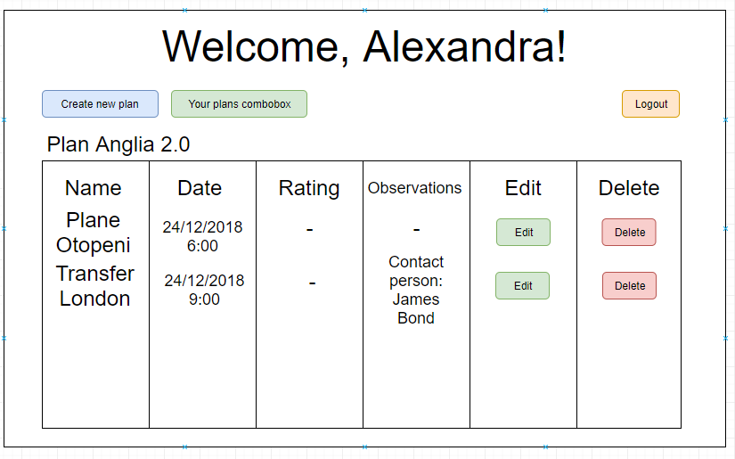

# Faza 1 - Tehnologii web
## Plan de calatorie integrat cu Weather Underground

1. Introducere
* Problema identificata

	Ne propunem realizarea unei aplicatii de tip web prin care utilizatorii acesteia sa isi poata realiza planuri de calatorie. In multe ocazii se poate intampla ca organizarea unei vacante **sa nu fie prea bine organizata** si acest lucru _cauzeaza neplaceri_.
	Prin aceasta solutie se poate realiza o structura a calatoriei, dar si un istoric al acestora, cu observatiile de rigoare.
	Pasii pe care trebuie sa ii urmeaza utilizatorul de la intrarea pe platforma sunt: logarea in contul propriu sau realizarea unui cont nou daca nu detin unul, realizarea unui plan nou de calatorie prin completarea campurilor aferente, adaugarea de locatii, daca nu se afla deja in baza de date si adaugarea de pasi ai calatoriei.
	Inainte de finalizarea planulul, acesta poate **verifica vremea** in perioada indicata. Dupa realizarea calatoriei, el poate introduce cateva _observatii despre aceasta si o nota_.
* Public tinta
	
	Aplicatia se adreseaza persoanelor care sunt pasionate de calatorati, dar si celor care fac acest lucru in interes profesional.
	Asadar exista doua linii principale de promovare a aplicatiei. Prima dintre ele o reprezinta domeniul **B2C** (business to customer), unde ne adresam persoanelor fizice ce isi doresc o mai buna organizare a calatoriilor. A doua este cea de **B2B** (business to business) unde ne adresam organizatiilor care realizeaza peste 50 de zboruri pe an, astfel putand sa le realizeze itinerariul angajatilor.
* Produse similare

#### TripIt

TripIt ofera o varianta gratuita si una cu plata, pentru 49$/an. Aplicatia gratuita dispune ne mai putine functionalitati in timp ce varianta platita are o multime de posibilitati de organizare a unei calatorii.
#### World Mate

World Mate ofera aproximativ aceleasi lucruri ca si TripIt, avand de asemenea si o varianta cu plata, de data aceasta de doar 9,99$/an. Prin aceasta se pot organiza zborurile, transferurile de la aeroport, partea de check-in de la aeroport si altele.
#### Trip Case

Trip case este singura aplicatia de tip web, dintre cele 3 produse similare, ce ofera posibilitatea de a realiza un plan de calatorie si de a adouga diversi pasi pentru aceasta. Cateva exemple sunt cina, intalnire de afaceri, transport in comun, zbor.

2. Interfata aplicatie
* Pagina de login

* Realizarea unui nou cont

* Realizarea unui nou plan

* Vizualizarea planurilor


3. API REST
* GET /user?username={usernameParam}&password={passwordParam}
Exemple raspuns:
```json
{
	"code": 200,
	"response": {
		"id": "1",
		"username": "Alexandra123",
		"lastname": "Modreanu",
		"firstname": "Alexandra",
		"e-mail": "alexandra.modreanu@gmail.com",
		"sex": "F"
	}
}
```
```json
{
	"code": 500,
	"response": {
		"errorText": "Wrong e-mail"
	}
}
```
* POST /user

Request Body:

```json
{
	"id": "1",
	"username": "Alexandra123",
	"lastname": "Modreanu",
	"firstname": "Alexandra",
	"e-mail": "alexandra.modreanu@gmail.com",
	"sex": "F"
}
```
Exemple raspuns:

```json
{
	"code": 200
}
```
```json
{
	"code": 500,
	"response": {
		"errorText": "Wrong e-mail"
	}
}
```

* GET /locatii

Exemplu raspuns:

```json
{
	"code": 200,
	"response": [{
		"id": "1",
		"name": "London"
	},
	{
		"id": "2",
		"name": "Machester"
	}]
}
```

* GET /planuri?userId={userIdParam}

Exemplu raspuns:
```json
{
	"code": 200,
	"response": [{
		"id": "1",
		"idUtilizator": "1",
		"name": "Plan Anglia",
		"steps": [
		{
			"id": "1",
			"name":"Avion Otopeni",
			"date": "2018-12-24+06:00",
			"observations": null
		},
		{
			"id": "2",
			"name":"Transfer Londra",
			"date": "2018-12-24+09:00",
			"observations": null
		}
		],
		"locations": [
		{
			"id": "1",
			"name":"Greate wall",
			"date": "2018-12-24+12:00",
			"rating": null,
			"observations": null
		},
		{
			"id": "2",
			"name":"London Eye",
			"date": "2018-12-24+13:30",
			"rating": null,
			"observations": null
		}
		],
	"observations": null,
	"rating": null
	}]
}
```
* POST /plan

Request Body:
```json
{
		"idUtilizator": "1",
		"name": "Plan Anglia",
		"steps": [
		{
			"name":"Avion Otopeni",
			"date": "2018-12-24+06:00",
			"observations": null
		},
		{
			"name":"Transfer Londra",
			"date": "2018-12-24+09:00",
			"observations": null
		}
		],
		"locations": [
		{
			"name":"Greate wall",
			"date": "2018-12-24+12:00",
			"rating": null,
			"observations": null
		},
		{
			"name":"London Eye",
			"date": "2018-12-24+13:30",
			"rating": null,
			"observations": null
		}
		],
	"observations": null,
	"rating": null
	}
```

* PUT /plan?planId={planIdParam}

Request Body:
```json
{
	"name": "Plan Anglia 2.0",
}
```

Exemplu raspuns:

```json
{
	"code": 200
}
```

* DELETE /plan?planId={planIdParam}

Exemplu raspuns:

```json
{
	"code": 200
}
```
```json
{
	"code": 500,
	"response": {
		"errorText": "Plan with sent id doesn’t exist."
	}
}
```

4. Functionalitati
- Realizarea de conturi noi cu username, parola si alte date.
- Logarea in aplicatie prin contul realizat.
- Realizarea unui nou plan de calatorie.
- Adaugarea in baza de date a unei locatii, daca aceasta nu exista deja.
- Adaugarea unui pas pentru o calatorie.
- Verificarea vremii pentru perioada indicata.
- Adaugarea de observatii pentru locatie, alaturi de o nota.
- Modificarea unui plan de calatorie deja realizat.
- Stergerea unui plan de calatorie.
